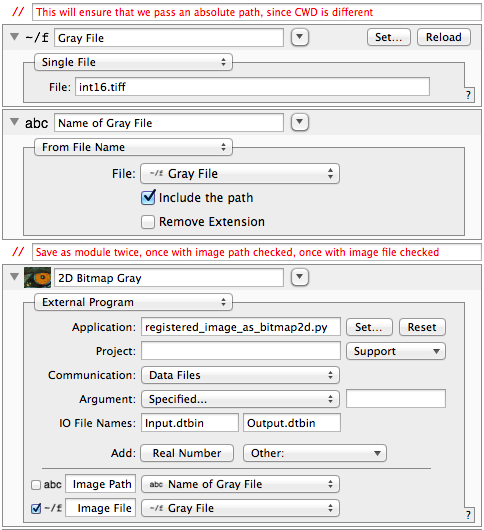

.. _bitmap2d:

*******************************
Georeferenced 2D Bitmap Example
*******************************

.. _bitmap2d_prereqs:

Prerequisites
=============

You may already have `GDAL <https://pypi.python.org/pypi/GDAL/>`_
and its Python bindings installed -- you can check by doing::

  python -c 'import gdal'

For a binary install of GDAL, see 
`this page <http://trac.osgeo.org/gdal/wiki/DownloadingGdalBinaries>`_
which has links for various platforms. The Mac OS X framework package
includes Python bindings.
  
.. _bitmap2d_example:

Usage example
=============

This example shows different ways of passing a file to an external program.
In one case, we pass a DataTank "File" object, which results in a hard link
named "Image File" in the Python program's working directory. This is most
efficient in terms of disk space, but sometimes a geospatial raster includes
a so-called "world file" which provides coordinate information, rather than
embedding it in the TIFF tags.
For example, "my_geotiff.tiff" could have a corresponding "my_geotiff.tfw"
and GDAL knows to look for that file alongside the GeoTIFF. In that case,
you need to pass the absolute path.

Clear as mud? Use The Source, Luke! Hopefully this example will clarify
the words above.

.. sourcecode:: python

    #!/usr/bin/env python
    # -*- coding: utf-8 -*-

    # This software is under a BSD license.  See LICENSE.txt for details.

    import os
    import numpy as np
    from datatank_py.DTDataFile import DTDataFile
    from datatank_py.DTBitmap2D import DTBitmap2D
    from time import time

    if __name__ == '__main__':
    
        #
        # This program replaces a standard DataTank External Program module
        # in C++.  Note that it must be executable (chmod 755 in Terminal)
        # and gdal and numpy are required.
        #
        # It takes as input a file path, then loads an image from it, using
        # GDAL to determine the raster origin and pixel size.  The image is
        # then saved as a 2D Bitmap object, either 8 or 16 bits as needed.
        #
        # Note that this is not appropriate for elevation data, as DataTank
        # will normalize the file range from [0, 1] if you extract the gray
        # component.
        #
    
        input_file = DTDataFile("Input.dtbin")

        # DT creates this hard link in the working directory, if passed a file.
        # This is preferred, as it's fewer variables in DataTank, but if you
        # have a world file, GDAL needs to be able to find it in the original
        # directory.
        image_path = "Image File"
        
        # if no path set, then use the file itself (preferable)
        if os.path.exists(image_path) == False:
            image_path = input_file["Image Path"]

        input_file.close()
    
        start_time = time()
        errors = []
    
        if image_path:
            image_path = os.path.expanduser(image_path)
        if image_path is None or os.path.exists(image_path) is False:
            errors.append("\"%s\" does not exist" % (image_path))
    
        img = DTBitmap2D(image_path)
        if img is None:
            # set an error and bail out; DataTank doesn't appear to use this, but displays
            # stderr output instead, so print them also
            errors.append("Unable to open as an image file")
            with DTDataFile("Output.dtbin", truncate=True) as output_file:
                output_file["ExecutionErrors"] = errors
                output_file.["ExecutionTime"] = time() - start_time
                exit(1)
                        
        with DTDataFile("Output.dtbin", truncate=True) as output_file:
        
            output_file.["ExecutionTime"] = time() - start_time
            output_file["Var"] = img
                        
            # need to save a StringList of execution errors as Seq_ExecutionErrors
            if len(errors):
                output_file["ExecutionErrors"] = errors
