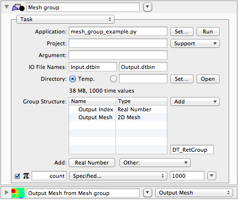

.. _dtdatafile:

**********
Data Files
**********

DTDataFile
==========

This is the primary interface for communication between DataTank
and a Python-based helper program, assuming you use files for
communication. It allows you to read, write, and append to a
DataTank binary file (extension `.dtbin`).

.. autoclass:: datatank_py.DTDataFile.DTDataFile
   :members:
   :special-members: __init__

DTPyWrite
=========

.. automodule:: datatank_py.DTPyWrite
   :members:
   :special-members: __dt_write__, __dt_type__
   
DTSeries
========

.. autoclass:: datatank_py.DTSeries.DTSeries
   :members:
   :special-members: __init__

DTSeriesGroup
=============

This class allows custom objects to be created and returned, and is
particularly useful when you want to compute a full time series of
variables all at once.
   

.. sourcecode:: python

    #!/usr/bin/env python
    # -*- coding: utf-8 -*-

    from datatank_py.DTDataFile import DTDataFile
    from datatank_py.DTProgress import DTProgress
    from datatank_py.DTSeries import DTSeriesGroup
    from datatank_py.DTMesh2D import DTMesh2D
    from time import time
    import numpy as np

    if __name__ == '__main__':
    
        # dummy input file, just as boilerplate
        input_file = DTDataFile("Input.dtbin")
        COUNT = int(input_file["count"])
        input_file.close()
    
        start_time = time()
    
        with DTDataFile("Output.dtbin", truncate=True) as df:
        
            # Task groups use DTProgress for the progress bar
            progress = DTProgress()
    
            # Define the group structure using a dictionary, using the variable name as key,
            # and the DataTank type as the value.  This is used to create the file header.
            name_to_type = { "Output Mesh":"2D Mesh", "Output Index":"Real Number" }
        
            # Create a new DTSeriesGroup instance using that type mapping.  For a task group
            # to be run in DT, we want to use the "Var" name.
            group = DTSeriesGroup(df, "Var", name_to_type)

            # return the step to avoid getting fouled up in computing it
            (x, dx) = np.linspace(-10, 10, 50, retstep=True)
            (y, dy) = np.linspace(-10, 10, 100, retstep=True)
            grid = (np.min(x), np.min(y), dx, dy)
            xx, yy = np.meshgrid(x, y)
        
            def mesh_function(x, y, p):
                return np.cos(x + p) + np.cos(y + p)
                
            for idx in xrange(COUNT):
                mesh = mesh_function(xx, yy, idx / 10.)
                group.add(idx / 10., { "Output Mesh":DTMesh2D(mesh, grid=grid), "Output Index":idx })
                progress.update_percentage(float(idx) / COUNT)
            
            # save execution time, and errors as a string list
            df.write_anonymous([""], "ExecutionErrors")
            df.write_anonymous(time() - start_time, "ExecutionTime")

.. autoclass:: datatank_py.DTSeries.DTSeriesGroup
   :members:
   :special-members: __init__
   
DTError
=======

.. automodule:: datatank_py.DTError
   :members:

DTProgress
==========

.. autoclass:: datatank_py.DTProgress.DTProgress
   :members:
