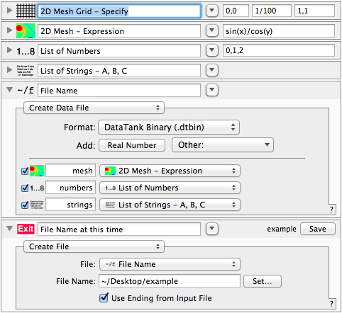

.. _getting_started:

***************
Getting started
***************

.. _installing_module:

Installing the module
=====================

You may already have `datatank_py <https://github.com/amaxwell/datatank_py>`_
installed -- you can check by doing::

  python -c 'import datatank_py'

If that fails grab the latest version from GitHub with::

  > git clone https://github.com/amaxwell/datatank_py.git
  > cd datatank_py
  > sudo python setup.py install
  
.. _file_read_example:

Example: Reading a DataTank file
================================

Create a data file in DataTank, and read the variables using :class:`datatank_py.DTDataFile.DTDataFile`.
A few points are worth noting:

#. Variable structure is complicated, but is documented in DataTank's manual
   (see the menu "Help -> Manual -> DataTank Manual (pdf)" in DataTank)
#. Some arrays have one or more empty dimensions, and may need to be flattened
#. Strings are ``unicode`` objects in Python

>>> from datatank_py.DTDataFile import DTDataFile
>>> dtf = DTDataFile("example.dtbin")
>>> for name in dtf:
...   print "%s = %s" % (name, dtf[name])
... 
Seq_strings = StringList
Seq_numbers = NumberList
strings_offs = [[[0 2 4]]]
mesh_loc = [[[ 0.    0.    0.01  0.01]]]
mesh = [[[ 0.          0.00999983  0.01999867 ...,  0.83049737  0.83602598
    0.84147098]
  [ 0.          0.01000033  0.01999967 ...,  0.8305389   0.83606778
    0.84151306]
  [ 0.          0.01000183  0.02000267 ...,  0.8306635   0.83619321
    0.84163931]
  ..., 
  [ 0.          0.0179523   0.0359028  ...,  1.49095827  1.50088355
    1.51065875]
  [ 0.          0.01822493  0.03644803 ...,  1.51360072  1.52367674
    1.53360039]
  [ 0.          0.01850785  0.03701385 ...,  1.53709759  1.54733002
    1.55740772]]]
numbers = [[[ 0.  1.  2.]]]
Seq_mesh = Mesh2D
strings = [u'A', u'B', u'C']

At this point, you can manipulate or modify the variables, and can
even append to the file. *However, you cannot modify existing variables
in a file!*

Example: Manipulating a 2D mesh
===============================

.. _mesh_example:

In this example, we create a 2D mesh in DataTank and multiply it
by a scalar value using Python. This is contrived, as it's obviously
easier to do this within DataTank itself! However, the code shown here
is the basic skeleton of any DataTank module that you'll create using
Python.

.. sourcecode:: python

    #!/usr/bin/env python
    # coding: utf-8

    # These are basically like C includes; you can also use
    # `from datatank_py import *` to get everything, but then
    # you refer to classes as DTDataFile.DTDataFile("/tmp/blah")
    # and so forth.
    from datatank_py.DTDataFile import DTDataFile
    from datatank_py.DTMesh2D import DTMesh2D

    from time import time
    import sys

    def computation(mesh, scalar):
    
        # mesh is DTMesh2D
        # scalar is float
        # return a DTMesh2D object
    
        # here we get the values, which is a 2D mesh
        values = mesh.values()
    
        # just multiply all values by the constant
        values *= scalar
    
        # return a new mesh object, reusing the same grid with our new values
        return DTMesh2D(values, grid=mesh.grid())

    if __name__ == '__main__':
    
        with DTDataFile("Input.dtbin") as input_file:
        
            # This is the highest level way to get an object, but isn't a complete
            # feature for all classes yet. Alternate way to get it would be
            # mesh = DTMesh2D.from_data_file(input_file, "input"), which is
            # slightly more verbose and requires you to import DTMesh2D.
            mesh = input_file.dt_object_named("input")
        
            # This uses Python's dictionary getter syntax to get a primitive object
            # that isn't wrapped in a DT class. This is the most convenient way to
            # get an array, number, string, or list of strings.
            scalar = input_file["scalar"]
        
            start_time = time()
            errors = []
        
            # This is just an example; another possibility is wrapping the entire
            # main call in an exception handler.
            try:
                output_mesh = computation(mesh, scalar)
            except Exception, e:
                errors.append("Exception raised: %s" % (e))
            
            # create or truncate the output file    
            with DTDataFile("Output.dtbin", truncate=True) as output_file:
                # record computation time
                output_file["ExecutionTime"] = (time() - start_time)
        
                # DataTank seems to display stderr instead of the error list, so
                # make sure to write to both.
                if len(errors):
                    output_file["ExecutionErrors"] = errors
                    sys.stderr.write("%s\n" % errors)
            
                else:
                    # save the output variable; this will be visible to DataTank
                    #sys.stderr.write("%s: %s\n" % (type(output_string), output_string))
                    output_file["Var"] = output_mesh            

If you've ever written a C++ program for DataTank, using the Xcode
skeleton provided with it, the preceding code should look familiar.
However, `datatank_py` implements and uses Python idioms whereever
possible, as a straight C++ translation is undesirable for most Python
programmers (not to say unreadable).

